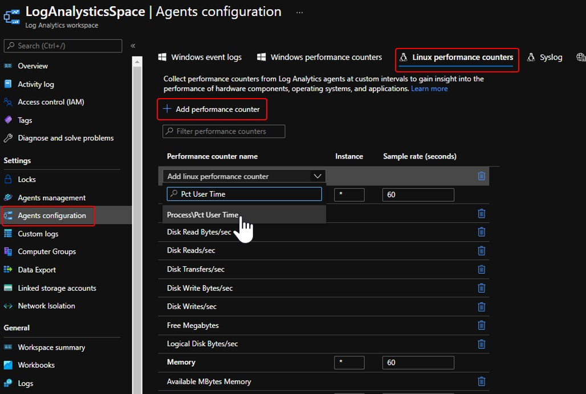
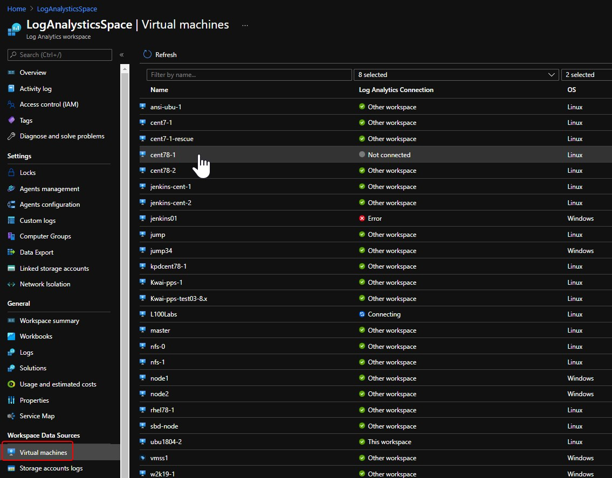
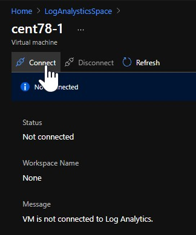
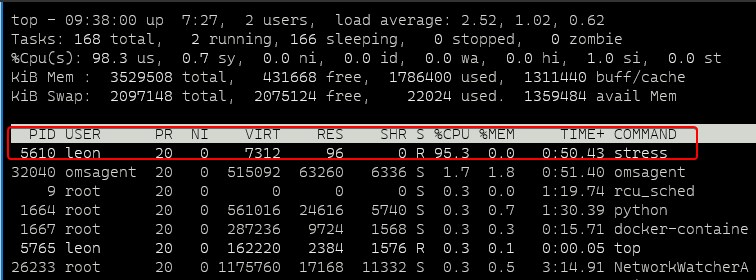
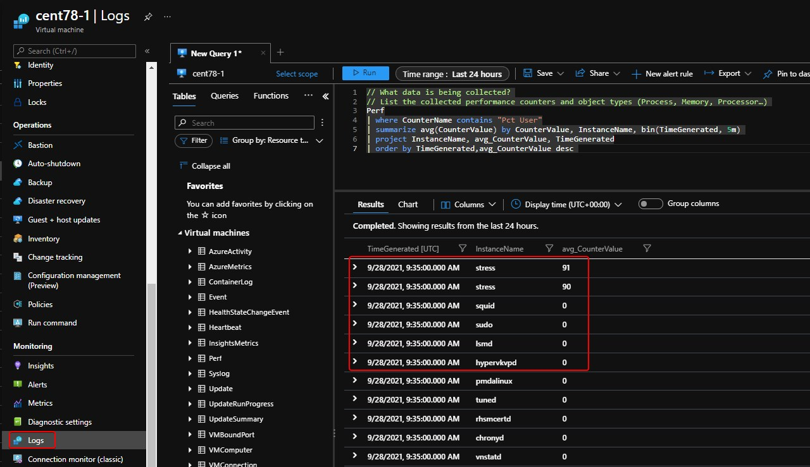

## Query guest OS process CPU with Log Analytics

1. Log into [Azure portal](https://portal.azure.com/)
2. Open your Log Analytics Space (create one if you do not have) and [Add agent performance counter](https://docs.microsoft.com/en-us/azure/azure-monitor/agents/data-sources-performance-counters)
    - Click **Agents configuration**
    - Click **Linux performance counters**
    - Click **Add performance counter**
    - Select **Pct User Time**
    - Click **Apply**
    
3. Connect VM into the Log Analytics Workspace
    - Click **Virtual machines**
    - Select the VM you want to monitor, for example: cent78-1
     <br/>
    - Click **Connect**
    
4. Simulate high CPU inside VM guest OS (for exampel: CentOS)
    - SSH into VM
    - Load stress  
    `[leon@cent78-1 ~]$ sudo yum install stress -y`
    `[leon@cent78-1 ~]$ stress –cpu 1`
    - Open another SSH session to check CPU consumption
    `[leon@cent78-1 ~]$ top`
    
5. Query CPU consumption
    - Open VM in Azure portal
    - Click **Logs**
    - Query the CPU consumption <br/>
        ```
        Perf
        | where CounterName contains "Pct User"
        | summarize avg(CounterValue) by CounterValue, InstanceName, bin(TimeGenerated, 5m)
        | project InstanceName, avg_CounterValue, TimeGenerated
        | order by TimeGenerated,avg_CounterValue desc
        ```
    


