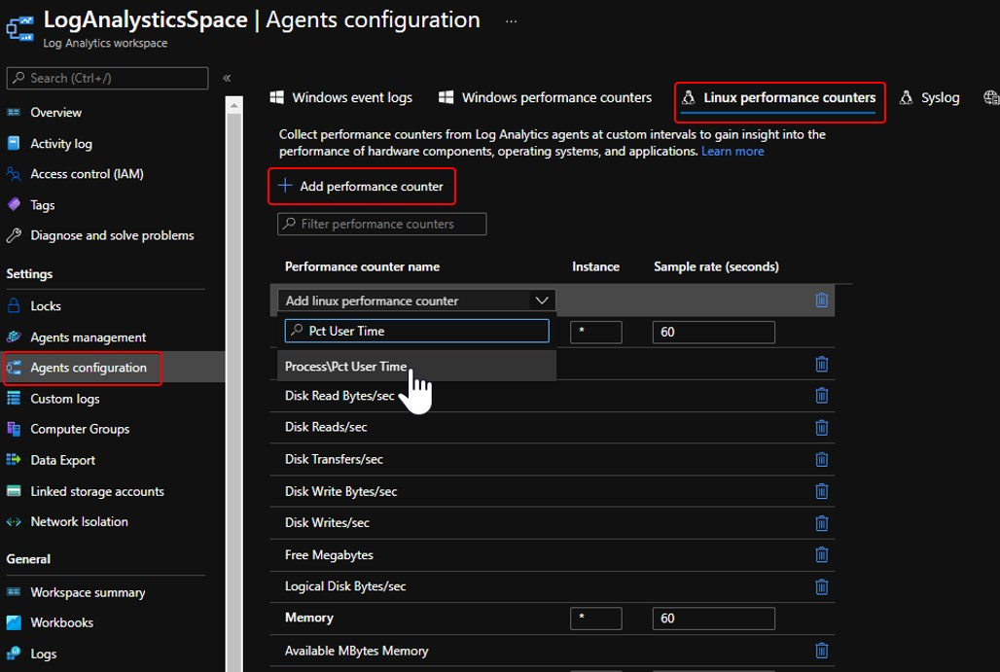
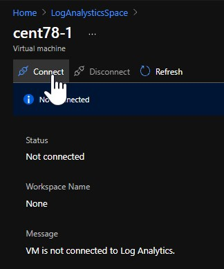
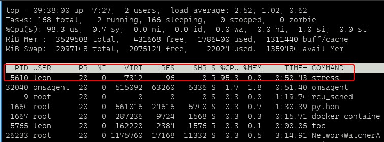
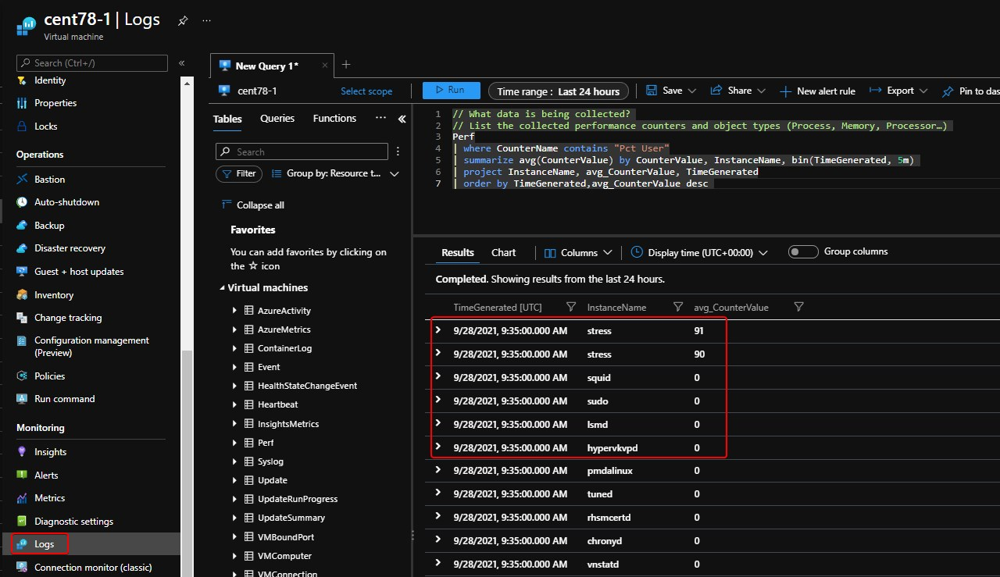
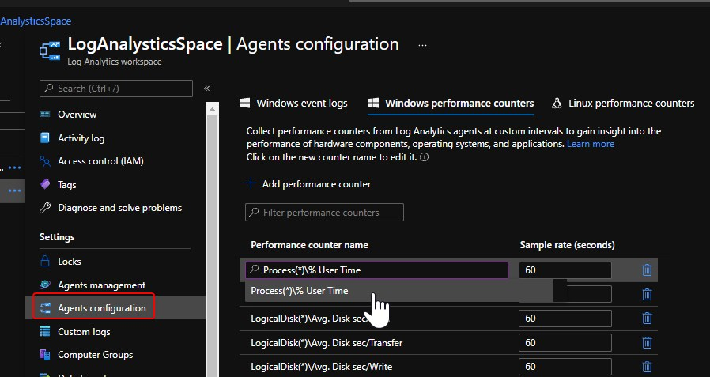
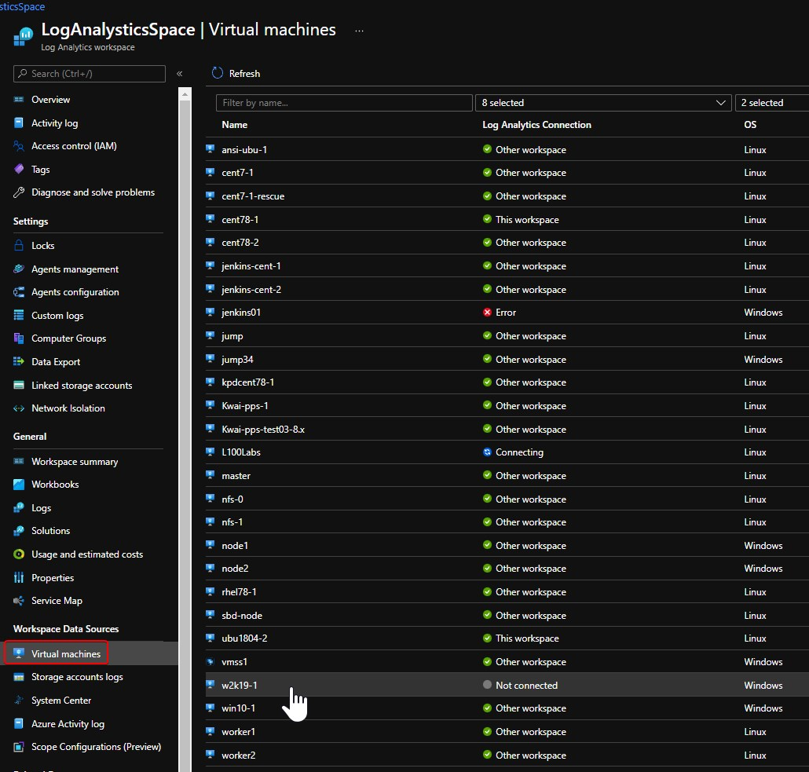
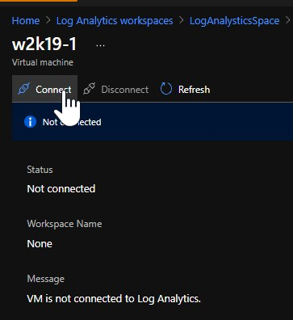
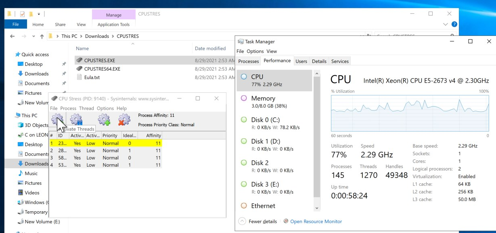

## Query guest OS process CPU with Log Analytics

### Linux

1. Log into [Azure portal](https://portal.azure.com/)
2. Open your Log Analytics Space (create one if you do not have) and [Add agent performance counter](https://docs.microsoft.com/en-us/azure/azure-monitor/agents/data-sources-performance-counters)
    - Click **Agents configuration**
    - Click **Linux performance counters**
    - Click **Add performance counter**
    - Select **Pct User Time**
    - Click **Apply**
    
3. Connect VM into the Log Analytics Workspace
    - Click **Virtual machines**
    - Select the VM you want to monitor, for example: cent78-1
      
    - Click **Connect**  
    
4. Simulate high CPU inside VM guest OS (optiontinal step, for example: CentOS7.8)
    - SSH into VM
    - Load stress for 10 mins  
    `[leon@cent78-1 ~]$ sudo yum install stress -y`  
    `[leon@cent78-1 ~]$ stress --cpu 1`
    - Open another SSH session to check CPU consumption  
    `[leon@cent78-1 ~]$ top`  
      
    - Press Ctrl-C in both sessions to stop simulation
5. Query CPU consumption
    - Open VM in Azure portal
    - Click **Logs**
    - Query the CPU consumption
        ```
        Perf
        | where CounterName contains "Pct User"
        | summarize avg(CounterValue) by CounterValue, InstanceName, bin(TimeGenerated, 5m)
        | project InstanceName, avg_CounterValue, TimeGenerated
        | order by TimeGenerated,avg_CounterValue desc
        ```
    

### Windows

1. Log into [Azure portal](https://portal.azure.com/)
2. Open your Log Analytics Space (create one if you do not have) and [Add agent performance counter](https://docs.microsoft.com/en-us/azure/azure-monitor/agents/data-sources-performance-counters)
    - Click **Agents configuration**
    - Click **Windows performance counters**
    - Click **Add performance counter**
    - Select **Process(*)\% User Time**
    - Click **Apply**
    
3. Connect VM into the Log Analytics Workspace
    - Click **Virtual machines**
    - Select the VM you want to monitor, for example: cent78-1
      
    - Click **Connect**  
    
4. Simulate high CPU inside VM guest OS (optiontinal step, for example: Windows 2019 DataCenter)
    - RDP into VM
    - Download [CPUStres](https://docs.microsoft.com/en-us/sysinternals/downloads/cpustres)
    - Extract downloaded Zip file
    - Start Task Manager to monitor the CPU performance
    - Double click CPUSTRES.EXE, select multiple threads to increase the CPU load for 10 minutes
          
    - Close both Windows
5. Query CPU consumption
    - Open VM in Azure portal
    - Click **Logs**
    - Query the CPU consumption
        ```
        Perf
        | where CounterName contains "User Time"
        | summarize avg(CounterValue) by CounterValue, InstanceName, bin(TimeGenerated, 5m)
        | project InstanceName, avg_CounterValue, TimeGenerated
        | order by TimeGenerated,avg_CounterValue desc
        ```
    
